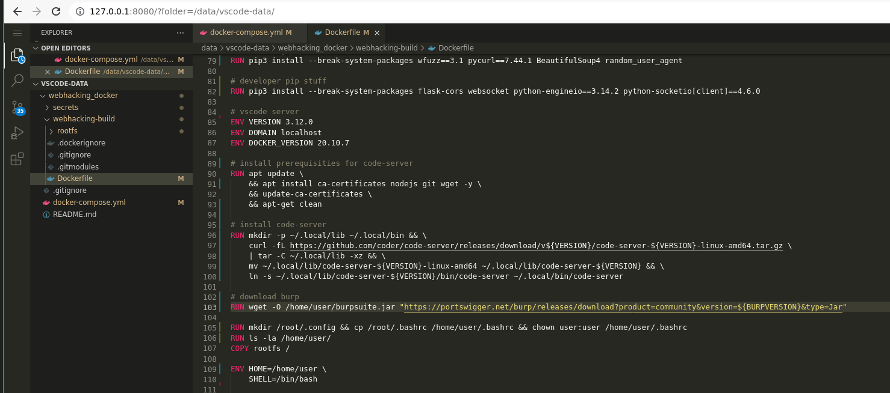
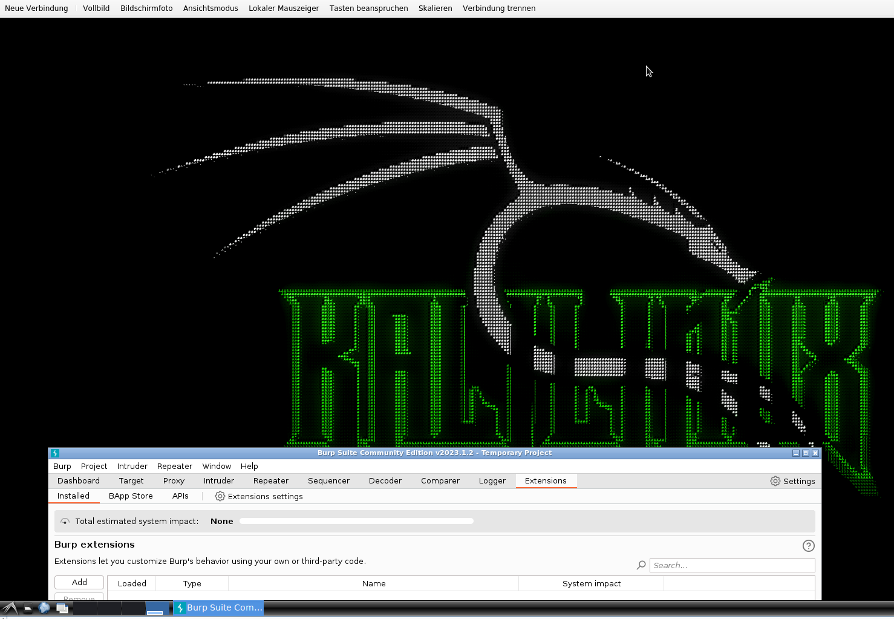

# webhacking_docker

Kali Linux based Container Image for Webhacking and Source code Review. (created for OSWE course)

  * includes everything to work on the OSWE Labs
    * (the only thing is Python Remote Debugging which doesn't work properly with included Codeserver)
  * spawns multiple Applications via supervisord
  * can be used via
    * VNC
    * SSH
    * pre-installed Codeserver (web-based VSCode)

## Screenshots

| Codeserver | VNC Access |
|--------------------------------------|--------------------------------------|
|  |  |

## How to use

  * Rename `webhacking.template` to `webhacking.env` and fill values
  * Start Container with:
    * `docker-compose up -d`
  * Connect SSH via:
    * `ssh -p2222 user@127.0.0.1`
  * Connect VNC via:
    * `vnc://127.0.0.1:5900`

## Mentions

  * Container-Image is based on https://github.com/fcwu/docker-ubuntu-vnc-desktop modified to use with Kali
  * Web-based Editor is Codeserver: https://github.com/coder/code-server
  * Awesome Desktop Wallpaper from: https://github.com/owerdogan/wallpapers-for-kali
